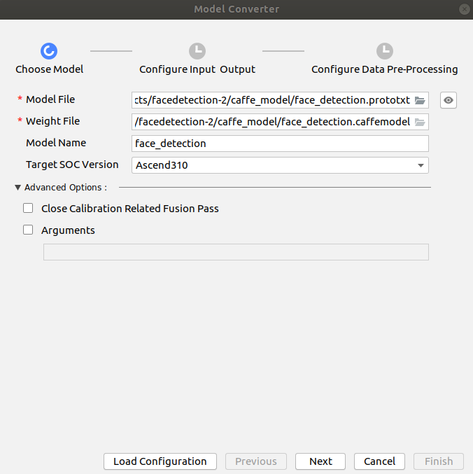
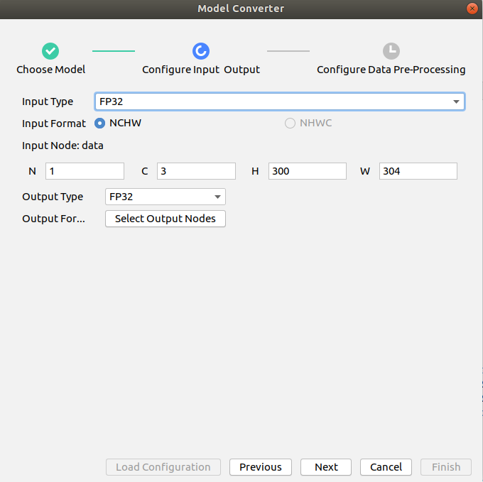
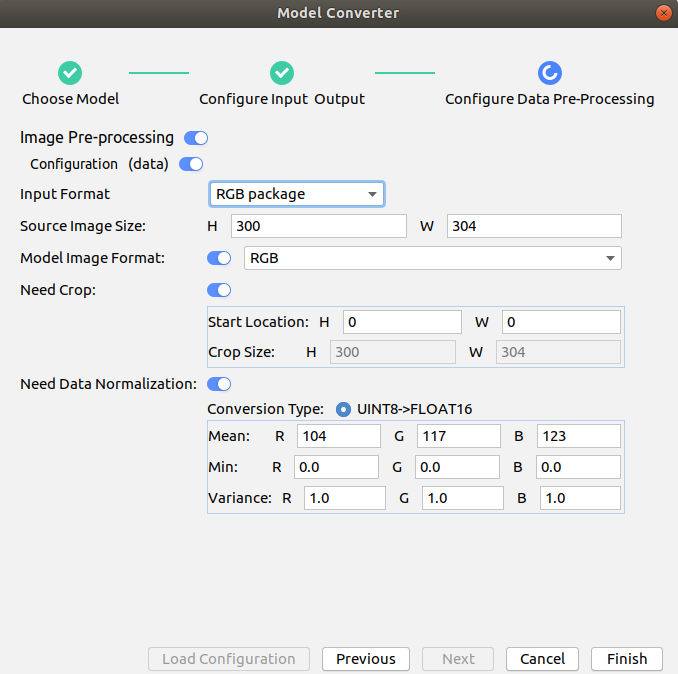

# facedetection

#### 介绍

本项目是基于Atlas 200 DK实现人脸识别推理工程

基于https://gitee.com/ascend/samples/tree/master/facedetection/for_atlas200dk_1.7x.0.0_c++ 修改，原工程输入视频是基于Atlas 200 DK上板载树莓派摄像头且预处理使用了DVPP，修改后的工程预处理删除了DVPP使用的opencv、输入支持本地视频文件或者rtsp视频流


### 目录结构

```
├── caffe_model
│   ├── face_detection.caffemodel
│   └── face_detection.prototxt
├── CMakeLists.txt
├── data
│   ├── detection.mp4
│   ├── person_2.mp4
│   ├── person_and_car.mp4
│   ├── person.mp4
│   └── shopping_hall.mp4
├── display.log
├── inc
│   ├── face_detect.h
│   ├── model_process.h
│   ├── sample_process.h
│   └── utils.h
├── model
│   └── face_detection.om
├── script
│   └── presenterserver
│       ├── common
│       │   ├── app_manager.py
│       │   ├── channel_handler.py
│       │   ├── channel_manager.py
│       │   ├── __init__.py
│       │   ├── parameter_validation.py
│       │   ├── presenter_message_pb2.py
│       │   └── presenter_socket_server.py
│       ├── display
│       │   ├── config
│       │   │   ├── config.conf
│       │   │   └── logging.conf
│       │   ├── __init__.py
│       │   ├── src
│       │   │   ├── config_parser.py
│       │   │   ├── display_server.py
│       │   │   ├── __init__.py
│       │   │   └── web.py
│       │   └── ui
│       │       ├── static
│       │       │   ├── css
│       │       │   │   ├── base.css
│       │       │   │   ├── dialog.css
│       │       │   │   ├── list.css
│       │       │   │   └── testvideo.css
│       │       │   ├── images
│       │       │   │   ├── loading.gif
│       │       │   │   ├── logo.png
│       │       │   │   ├── u1.png
│       │       │   │   ├── u2.png
│       │       │   │   ├── u3.png
│       │       │   │   ├── u4.png
│       │       │   │   ├── u5.png
│       │       │   │   └── u6.png
│       │       │   └── js
│       │       │       ├── dialog.js
│       │       │       ├── dialog.min.js
│       │       │       ├── index.js
│       │       │       ├── jquery-1.10.2.min.js
│       │       │       ├── socket.io.js
│       │       │       └── socket.io.min.js
│       │       └── templates
│       │           ├── home.html
│       │           └── view.html
│       ├── face_detection
│       │   ├── config
│       │   │   ├── config.conf
│       │   │   └── logging.conf
│       │   ├── __init__.py
│       │   ├── src
│       │   │   ├── config_parser.py
│       │   │   ├── face_detection_server.py
│       │   │   ├── __init__.py
│       │   │   └── web.py
│       │   └── ui
│       │       ├── static
│       │       │   ├── css
│       │       │   │   ├── base.css
│       │       │   │   ├── dialog.css
│       │       │   │   ├── list.css
│       │       │   │   └── testvideo.css
│       │       │   ├── images
│       │       │   │   ├── loading.gif
│       │       │   │   ├── logo.png
│       │       │   │   ├── u1.png
│       │       │   │   ├── u2.png
│       │       │   │   ├── u3.png
│       │       │   │   ├── u4.png
│       │       │   │   ├── u5.png
│       │       │   │   └── u6.png
│       │       │   └── js
│       │       │       ├── dialog.js
│       │       │       ├── dialog.min.js
│       │       │       ├── index.js
│       │       │       ├── jquery-1.10.2.min.js
│       │       │       ├── socket.io.js
│       │       │       └── socket.io.min.js
│       │       └── templates
│       │           ├── home.html
│       │           └── view.html
│       ├── __init__.py
│       ├── prepare_presenter_server.sh
│       ├── presenter_server.py
│       ├── README
│       └── requirements
└── src
    ├── acl.json
    ├── CMakeLists.txt
    ├── face_detect.cpp
    ├── main.cpp
    ├── model_process.cpp
    └── utils.cpp
```

### 模型转换

caffe_model目录是原caffe模型文件及权重文件，也可以参见原工程下载。

model目录是转换后的om模型，也可一按照一下方法转换：



 

### 修改Presenter Server的ip

将**script/presenterserver/display/config/config.conf**中的**presenter_server_ip**和**web_server_ip**修改为Mind Studio所在Ubuntu服务器的虚拟网卡的ip地址。

将**src/face_detect.cpp**中的 **param.host_ip** 修改为Mind Studio所在Ubuntu服务器的虚拟网卡的ip地址

### 启动Presenter Server

打开Mind Studio工具的Terminal，在应用代码存放路径下，执行Presenter Server主程序。

 **python3 script/presenterserver/presenter_server.py --app=display &**

### 其他操作及环境要求参见原工程